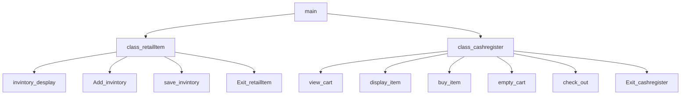

# chapter-10
jacob, even

##  Description

###  Flowchart

#### Function Diagrams

|  main   |               |    Jacob,even  |
| ------------------ | ------------- | ------------ |
|  no arguments   | Main calls class   |    returns nothing       |  
***
|   invintory_desplay  |               |    Jacob    |
| ------------------ | ------------- | ------------ |
|  accepts invintory  | shows all items in invintory |       returns invintory       |

***
|   Add_invintory  |               |    Jacob    |
| ------------------ | ------------- | ------------ |
|  accepts invintory  | adds item,number,and price to invintory  |     returns the new invintory     |

***
|  save_invintory   |               |   jacob     |
| ------------------ | ------------- | ------------ |
|  accept invintory   |  saves invintory  |      returns new_inventory        |
***
|  Exit_retailltem   |               |  jacob      |
| ------------------ | ------------- | ------------ |
|  accepts nothing   |  returns to main  |  returns nothing   |       
***
|  view_cart   |               |    even    |
| ------------------ | ------------- | ------------ |
|     |    |              |
***
|  display_item   |               |     even   |
| ------------------ | ------------- | ------------ |
|       |              |
***
|   buy_item  |               |     even   |
| ------------------ | ------------- | ------------ |
|       |              |
***
|    empty_cart |               |     even   |
| ------------------ | ------------- | ------------ |
|       |              |
***
|  check_out   |               |     even   |
| ------------------ | ------------- | ------------ |
|       |              |
***
|  Exit_cashregister   |               |     even   |
| ------------------ | ------------- | ------------ |
|       |              |
***
