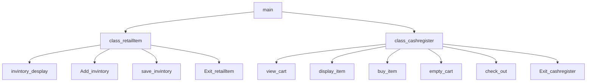

# chapter-10
jacob, even

##  Description

###  Flowchart

#### Function Diagrams

|  main   |               |    Jacob,even  |
| ------------------ | ------------- | ------------ |
|  no arguments   | Main calls all class   |           |  
***
|   invintory_desplay  |               |    Jacob    |
| ------------------ | ------------- | ------------ |
|    |  |              |

***
|   Add_invintory  |               |    Jacob    |
| ------------------ | ------------- | ------------ |
|    |   |           |

***
|  save_invintory   |               |   jacob     |
| ------------------ | ------------- | ------------ |
|     |   |              |
***
|  Exit_retailltem   |               |  jacob      |
| ------------------ | ------------- | ------------ |
|     |    |     |       
***
|     |               |    even    |
| ------------------ | ------------- | ------------ |
|     |    |              |
***
|     |               |     even   |
| ------------------ | ------------- | ------------ |
|       |              |
***
|     |               |     even   |
| ------------------ | ------------- | ------------ |
|       |              |
***
|     |               |     even   |
| ------------------ | ------------- | ------------ |
|       |              |
***
|     |               |     even   |
| ------------------ | ------------- | ------------ |
|       |              |
***
|     |               |     even   |
| ------------------ | ------------- | ------------ |
|       |              |
***
